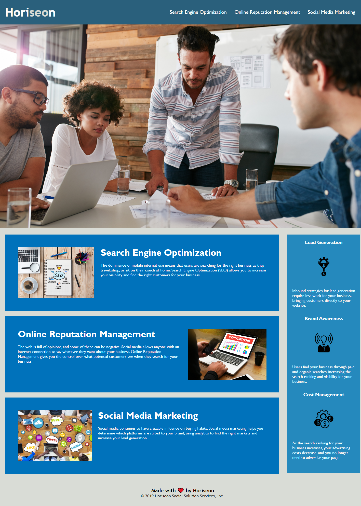

# horiseon-services-webpage

## Description

This project is for refactoring the Horiseaon Services webpage to meet standards and to implement new technology. 

Key imporovements include:

- Increasing web accessibility:
    - Ensure people with disabilities can access the webpage using assistive technologies.
    - Improve site ranking in search engines.
- Improve code base:
    - long-term sustainability.
    - Increase efficiency of the CSS by consolidating and organizing structure.

## Deployed Application

The deployed application site can be found at https://colbyrobins.github.io/horiseon-services-webpage/

## Webpage Screenshot

